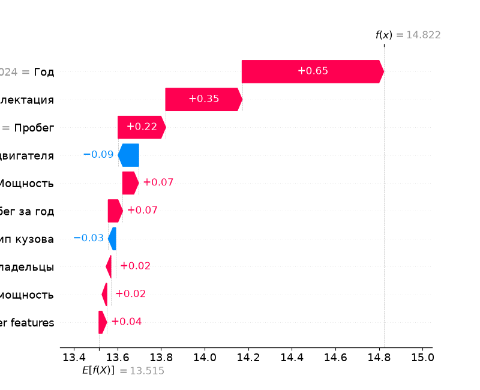
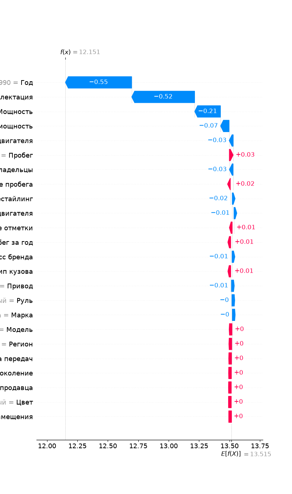
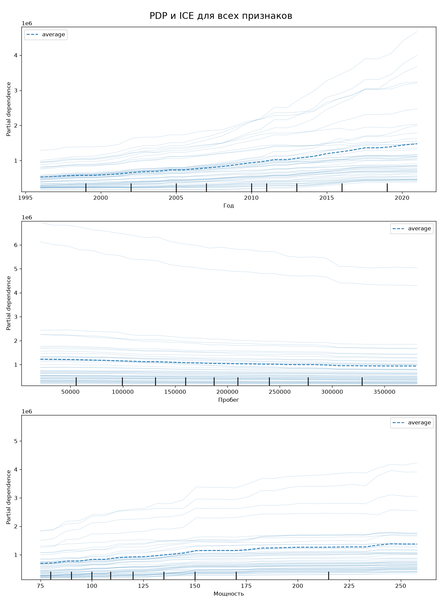

# 🚗 Car Price Analyzer


**Сервис оценки рыночной стоимости подержанных автомобилей на основе машинного обучения.**

[👉 Попробовать веб-приложение](http://691755.myvds.top/)
[👉 Альтернативная ссылка](http://130.49.186.38/)

Полный ML-проект: от сырых данных с drom.ru до интерактивного веб-приложения, которое по описанию автомобиля (своими словами!) определяет его справедливую цену и объясняет, из чего она складывается.

---

## ✨ Возможности

- **🤖 Автозаполнение формы через ИИ** — введите описание авто своими словами («Продаю ладу гранту 15 года, 2 владельца, пробег 40к, механика, 106 сил»), нейросеть (OpenRouter) извлечёт параметры и сама заполнит форму. Поля, заполненные ИИ, подсвечиваются ✨
- **📈 Прогноз цены** — CatBoost (оптимизирован Optuna) с учётом ~20 характеристик автомобиля. Цена выводится с диапазоном погрешности (MAPE ≈ 15.4%)
- **🔍 Проверка цены на адекватность** — введите цену из объявления: приложение предупредит, если цена сильно занижена (возможные скрытые дефекты, скрученный пробег, залоги)
- **📊 Интерпретация модели (SHAP)** — waterfall-диаграмма «Формирование цены по категориям факторов»: пробег и износ, двигатель, история, бренд, кузов, география. Каждый фактор в рублях
- **⚠️ Предупреждения о границах применимости** — модель честно предупреждает, когда данные выходят за область обучения (старые авто, огромный пробег)
- **🐳 Деплой через Docker** — одна команда до продакшена

---

## 🖥️ Как это выглядит


Интерфейс построен в 2 шага:

| Шаг | Что происходит |
|-----|----------------|
| **1. Автозаполнение** | Пользователь пишет свободное описание → LLM парсит → форма заполняется автоматически |
| **2. Проверка и расчёт** | Пользователь корректирует параметры (Human-In-The-Loop)→ «Рассчитать цену» → метрика цены + SHAP-разбор по группам факторов |

После расчёта показываются:

- 💰 Рекомендуемая цена с диапазоном `±` и погрешностью в %
- 🔴 Сигнал тревоги при подозрительно низкой цене
- 📊 Waterfall-график вклада категорий факторов в итоговую цену
- 📝 Детальный разбор каждого признака (что влияет и на сколько рублей)
- 🔬 Отладочная таблица сгенерированных признаков (по клику)

---

## 🏗️ Архитектура проекта

```
┌─────────────┐    ┌──────────────┐    ┌──────────────────┐    ┌──────────────┐
│  Сырые данные│──▶│  Очистка + EDA │──▶│ Feature Engineering│──▶│   Обучение    │
│  (drom.ru)   │    │  (notebooks) │    │  (feature_eng.py) │    │  (Optuna+CV)  │
└─────────────┘    └──────────────┘    └──────────────────┘    └──────┬───────┘
                                                                      │
┌─────────────┐    ┌──────────────┐    ┌──────────────────┐    ┌──────▼───────┐
│  SHAP-разбор │◀──│  Streamlit UI │◀──│    predict.py     │◀──│ CatBoost .pkl │
│ (shap_utils) │    │    (app.py)   │    │  (цена ± погреш.)│    │ best_model/   │
└─────────────┘    └──────▲───────┘    └──────────────────┘    └──────────────┘
                          │
                 ┌────────┴────────┐
                 │  LLM-парсер     │
                 │ (llm_parser.py) │──▶ OpenRouter API (бесплатная модель)
                 └─────────────────┘
```

**Ключевые модули:**

| Модуль | Назначение |
|--------|-----------|
| `app.py` | Веб-интерфейс Streamlit (вся логика UX) |
| `src/predict.py` | Загрузка модели и предсказание цены с диапазоном |
| `src/feature_eng.py` | Генерация признаков из сырых полей формы |
| `src/shap_utils.py` | SHAP-интерпретация в рублях |
| `src/llm_parser.py` | Извлечение параметров авто из текста через OpenRouter |

---

## 📁 Структура проекта

```
car-price-analyzer/
├── app.py                    # Streamlit-приложение
├── requirements.txt          # Зависимости
├── Dockerfile                # Контейнеризация
├── .streamlit/secrets.toml   # 🔑 API-ключ OpenRouter
│
├── data/                     # Данные (в .gitignore)
│   ├── raw/                  #   raw_dataset.csv (5 ГБ, 585k строк), df_optimal.parquet
│   ├── cleaned/              #   после очистки (train/test)
│   ├── optimized/            #   после легкой нормализации
│   └── features/             #   после feature engineering
│
├── notebooks/                # Основной пайплайн
│   ├── 01_data_cleaning.ipynb        # загрузка, очистка, сплит
│   ├── 02_eda_and_features.ipynb     # EDA, корреляции, признакообразование
│   └── 03_final_catboost_optimized.ipynb  # финальная обработка датасета и обучение модели
├── models/                   # Скрипты экспериментов
│   ├── 01_compare_defaults.py  # бейзлайны: Ridge/CatBoost/XGBoost/LightGBM
│   ├── 02_hpo_comparison.py    # GridSearch vs RandomSearch vs Optuna
│   ├── 03_final_compare.py     # финальный Optuna для каждой модели
│   └── *.pkl                   # обученная модель
│
├── best_model/               # 🏆 Финальная модель best_catboost_model.pkl
│
├── researches/               # Глубокие исследования
│   ├── 01_datasets_comparison.ipynb  # какой датасет лучше?
│   ├── 02_ice_pdp_analysis.ipynb     # PDP/ICE-графики
│   ├── 03_shap_interpretation.ipynb  # SHAP (beeswarm, waterfall)
│   └── 04_error_analysis.ipynb       # анализ ошибок по сегментам
│
├── src/                      # Продакшн-модули
│   ├── predict.py
│   ├── feature_eng.py
│   ├── shap_utils.py
│   └── llm_parser.py
│
└── diary/diary.md            # Дневник разработки 📔
```

---

## 🚀 Установка и запуск

### Локально

```bash
# 1. Склонировать репозиторий
git clone https://github.com/deviloon/car-price-analyzer.git
cd car-price-analyzer

# 2. Установить зависимости (Python 3.12+)
pip install -r requirements.txt

# 3. Добавить ключ OpenRouter (для ИИ-автозаполнения)
#    Создать файл .streamlit/secrets.toml:
#    OPENROUTER_API_KEY = "sk-or-v1-ваш-ключ"

# 4. Запустить приложение
streamlit run app.py
```

Приложение откроется на `http://localhost:8501`.

### Через Docker

```bash
docker build -t car-price-analyzer .
docker run -p 8501:8501 \
  -e OPENROUTER_API_KEY=sk-or-v1-ваш-ключ \
  car-price-analyzer
```

---

## 🎯 Как пользоваться

1. **Опишите автомобиль своими словами** — чем больше деталей (год, пробег, коробка, привод, владельцы, состояние), тем точнее, но можно и коротко, например:
   > «Продаю гранту 15 года, 2 владельца, пробег 40к, механика, 106 сил»
2. Нажмите **«Распарсить через ИИ»** — форма заполнится автоматически.
3. **Проверьте поля** (заполненные ИИ отмечены ✨) и при необходимости поправьте.
4. Нажмите **«Рассчитать цену и влияние факторов»**:
   - получите рекомендованную цену с диапазоном погрешности;
   - проверьте свою цену из объявления на адекватность;
   - изучите waterfall-график и детальный разбор, что на сколько влияет.

> 💡 Приложение работает и без API-ключа — просто заполните форму вручную. ИИ-парсер только ускоряет ввод.

---

## 📊 Данные

- **Источник:** объявления с drom.ru (2025 год, полугодовой срез — данные на 14.07.2025)
- **Объём:** ~585 000 объявлений, ~50 исходных признаков
- **Целевая переменная:** цена в рублях
- **Основные признаки:** марка, модель, год, пробег, тип/объём двигателя, мощность, коробка, привод, владельцы, регион, комплектация, цвет, особые отметки и др.

Данные хранятся в нескольких версиях — это осознанный подход «4 версии датасета»:

| Версия | Описание |
|--------|----------|
| `raw` | Сырые данные после первичного среза |
| `cleaned` | После удаления дубликатов, выбросов и аномалий |
| `features` | После Feature Engineering |
| `optimized` | Оптимизированный датасет с легкими работой с данными |

> ⚠️ **Главный инсайт проекта:** финальная модель лучше всего показала себя именно на **сыром** датасете (см. Исследования).

---

## 🧠 Методология

### 1. Очистка данных (`01_data_cleaning.ipynb`)
- Удаление дубликатов и откровенно битых строк
- Обработка выбросов по пробегу (>999 000 км), году (<1990) и цене
- Почистка «Особых отметок» от HTML-мусора (`&#\d+;`) и пунктуации
- Сплит на train/test
- Сильная нормализация, заполнение пропусков по группам

### 2. EDA и признаки (`02_eda_and_features.ipynb`)
- Анализ распределений цены → **log1p-преобразование целевой переменной** (сильная скошенность, длинный хвост дорогих авто)
- Корреляционный анализ через **Phik** (учитывает категориальные признаки; первый расчёт занял 55 минут!)
- Из-за огромной кардинальности удалены `Город`, `Макро-регион`, `Комплектация`
- Сгенерированные признаки:
  - `Класс бренда` — Люкс / Премиум / Эконом / Масс-маркет (ручные словари)
  - `Модель` — извлечение из полного названия
  - `Литровая мощность` = мощность / объём
  - `Возраст`, `Пробег за год` — скорость износа
  - `Тип продавца` — частник / дилер
  - `Год размещения` — учёт инфляции рынка

### 3. Модели и эксперименты (`models/`)
Эксперименты логируются в **MLflow** (SQLite):

**Этап 1 — бейзлайны** (`01_compare_defaults.py`): Ridge (OHE + CatBoostEncoder) против трёх градиентных бустингов с дефолтными параметрами (5-fold CV).

**Этап 2 — сравнение HPO-инструментов** (`02_hpo_comparison.py`): GridSearchCV vs RandomizedSearchCV vs Optuna на LightGBM. Вывод: Optuna даёт сравнимые результаты — выигрыш в скорости и удобстве, гиперпараметры дают лишь «копейки» по сравнению с работой над данными.

**Этап 3 — финальный Optuna** (`03_final_compare.py`): большой поиск для CatBoost (GPU), XGBoost (GPU), LightGBM; затем обучение на всех данных и оценка на тесте.

### 4. Финальная модель

**CatBoost** + `TransformedTargetRegressor(log1p → expm1)`, loss = MAPE, подобрана Optuna (~50 триалов, GPU, seed=42, `enqueue_trial` со старыми лучшими параметрами).

```python
# Лучшие параметры
{
    'bootstrap_type': 'Bernoulli', 'iterations': 2500, 'learning_rate': 0.042248138023520114,
    'depth': 10, 'l2_leaf_reg': 9.394802632887766, 'random_strength': 0.8303775333704183,
    'border_count': 207, 'subsample': 0.5483853226992782, 'loss_function': 'MAE', 'allow_writing_files': False,
    'eval_metric': 'MAE', 'random_seed': 42, 'thread_count': -1, 'task_type': 'GPU', 'verbose': 0
}
```
> 💡**Почему использовалась метрика MAE, хотя основная - MAPE?** Благодаря свойству логарифмов $|\ln(\hat{y}) - \ln(y)| = \left|\ln\left(1 + \frac{\hat{y}-y}{y}\right)\right|$ и приближению Тейлора $\ln(1+x) \approx x$, при небольших ошибках разность логарифмов с высокой точностью равна относительной ошибке $\left|\frac{\hat{y}-y}{y}\right|$, из которой и складывается MAPE.

---

## 📈 Результаты

### Сравнение бейзлайнов (датасет с признаками, дефолтные параметры)

| Модель | CV MAPE | Test MAPE |
|--------|---------|-----------|
| LightGBM | **17.85%** | **18.65%** |
| XGBoost | 17.96% | 18.52% |
| CatBoost | 18.08% | 18.43% |
| Ridge | 25.06% | 26.39% |

### Сравнение инструментов подбора гиперпараметров

| Инструмент | BEST MAPE | BEST MAE | TOTAL TIME |
|--------|---------|--------|-----------|
| GridSearch | 18.03% | 138k ₽ | 5.3 ч |
| RandomSearch | 18.03% | 138k ₽ | 1.2 ч |
| **Optuna** | **18.02%** | 138k ₽ | 1 ч |

### Финальное сравнение моделей (Optuna)

| Модель | CV MAPE | Test MAPE |
|--------|---------|-----------|
| LightGBM | 17.96% | 18.52% |
| XGBoost | 17.85% | 18.15% |
| **CatBoost** | **17.76%** | **18.08%** |

### Сравнение датасетов

| Датасет | CV MAPE | Test MAPE |
|--------|---------|-----------|
| raw | 15.69% | 15.48% |
| cleaned | 18.05% | 18.35% |
| features | 18.08% | 18.43% |
| optimized | 15.44% | 15.29% |

### 🏆 Финальная модель (CatBoost, обучена на оптимизированном датасете)

| Метрика | Значение |
|---------|----------|
| **Test MAPE** | **15.40%** |
| **CV MAPE** | **15.55%** |

> 💡 **Почему сырые данные победили очищенные?** Очистка (удаление выбросов) выбросила реальные рыночные закономерности — машины с «аномальными» параметрами стоят дороже/дешевле системно, и модель смогла их уловить. Это главный вывод исследования `researches/01_datasets_comparison.ipynb`: MAPE 0.1539 на сырых vs ~0.18 на очищенных и «обогащённых» версиях. Именно поэтому было решено создать ноутбук `notebooks/03_final_catboost_optimized.ipynb` с минимальной и самой важной обработкой данных - и модель выдапла ~0.154 MAPE, что подтвердило гипотезу: на слишком очищенных и "прилизанных" данных модель, особенно такая мощная как CatBoost, выдаёт результат в разы хуже, чем на датасете с только самыми необходимыми изменениями. Более детальный вывод и разбор приведен в `researches/01_datasets_comparison.ipynb`.


В приложении используется запас `MAPE = 0.1539` для честного диапазона цены: `[цена × (1 − 2·MAPE); цена × (1 + MAPE)]`.

---

## 🔬 Интерпретируемость

Проект не ограничивается «чёрным ящиком»:

- **SHAP** (`researches/03_shap_interpretation.ipynb`, `src/shap_utils.py`)
  
  - Beeswarm-графики и waterfall для конкретных авто (Lada 2106, Haval F7)
  
  
  - В приложении SHAP-вклады переводятся из логарифмов в **рубли** и группируются в категории
- **PDP / ICE** (`researches/02_ice_pdp_analysis.ipynb`)
  
  - Год: до ~2010 цена падает, в 2010–2015 растёт (утилизационный бум)
  - Пробег: экспоненциальное падение, вложения в уход не окупаются
  - Мощность: скачок цены на 150–160 л.с. (порог транспортного налога!)
- **Анализ ошибок** (`researches/04_error_analysis.ipynb`)
  - Худший сегмент — возраст/пробег: старые машины с большим пробегом дают MAPE > 300%
  - У дорогих авто относительная ошибка ниже, у дешёвых — выше

---

## 🛠️ Технологический стек

| Сфера | Инструменты |
|-------|-------------|
| Данные | pandas, numpy, pyarrow (parquet), phik |
| ML | CatBoost, XGBoost, LightGBM, scikit-learn, category_encoders |
| HPO | Optuna, GridSearchCV, RandomizedSearchCV |
| Эксперименты | MLflow (SQLite + mlruns) |
| Интерпретация | SHAP, PDP/ICE (sklearn) |
| Веб | Streamlit, Plotly |
| LLM | OpenRouter API (poolside/laguna-s-2.1:free) |
| Инфраструктура | Docker, Git |

---

## 🗺️ Роадмап

- [ ] Добавить базу данных (SQLite или PostgreSQL) чтобы логировать те изменения, которые пользователи вводят после ИИ, исправляя его. Это будет полезно для будущего fine-tuning LLM модели.
- [ ] Добавить каталог: при недостатке информации (например, если пользователь забыл объем двигателя), сервер будет обращаться к этой базе данных и автоматически добавлять нужную информацию в пропуски.
- [ ] Попытки улучшить ошибку (разделение ценовых сегментов и модели под каждого из него)

---

## 📚 Связанные материалы

- `notebooks/` — воспроизводимый пайплайн данных
- `researches/` — углублённые исследования модели

---

## 🧑‍💻 Автор

Проект создан в учебных целях (школьная защита, зима) как первое полноценное погружение в DS/ML: не «модель.fit() ради галочки», а комплексный подход — исследования, LLM-интеграция, UX, интерпретируемость.

---

## 📄 Лицензия

Проект распространяется под лицензией MIT. Подробнее см. в файле [LICENSE](LICENSE).
