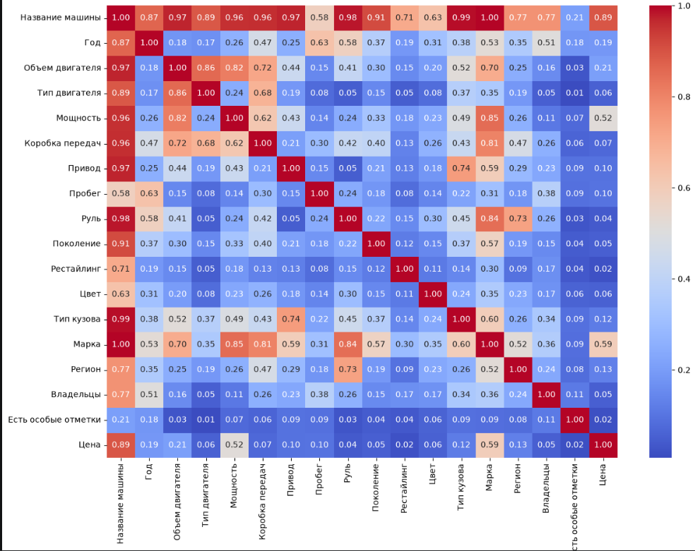

это мой дневник. начал я его 15.07. буду описывать любые сложности, идеи, инсайты, которые были во время работы

изначально решил делать проект из за скуки, да и просто хотел углубиться в ds/ml. выбрал регрессию - как самый простой вариант. но мощь проекта не в простом написании model.fit(), а в комплексном подходе: тут будут и исследования, и интеграцию в телеграм, и настройка ux, и внедрение llm. планирую показать его на школьной защите, которая будет зимой. следующий проект планирую сделать по mlops или cv, во что первее углублюсь. но это уже затравка на будущее

14.07. приехал  деревню. склонировал репозиторий. оказалось, что в до этого я прописал в гитигнор папку data (хотел спрятать от гитхаба только тяжелый исходный датасет), из за чего у меня не было,с чем работать. пришлось целый час качать датасет с каггла, чтобы продолжить работу. 
15.07. немного подустал делать eda и data cleaning. чем дальше я иду, все больше оказывается что я пропустил какие то моменты в очистке данных. например выбросы. скоро буду приступать к fe. пока хороших идей нет.

план:
разобраться с mlflow (для начала fe и последующего обучения)
сравниваю "голые модели" (линрег с масштабированием и (для forest) энкодингом). какая показала лучше - такую использую. сравниваю инструменты подбора гиперпараметров на , предположительно, кетбусте - выбираю победителя. теперь, прогоняю все исходные модели (тк времени много, всё успею). теперь у меня есть 3 модели с оптимальными параметрами, и сравнение будет объективным. кто покажет результат быстрее и лучше - того и выбираю

17.07. планирую закончить eda. ХАХАХА это жесть! я несколько часов бился с корреляцией phik. использовал ее вместо пирсона, тк она учитывает еще и кат. фичи. но в первый раз она грузилась 55 минут! в итоге решил остановить. потом ноут зависать начал. но отлагал. пришлось избавиться от признаков "Город", "Макро-регион" и "Комплектация" из-за ОГРОМНЕЙШЕЙ кардинальости. 
. Также сегодня столкнулся с рассинхронизацией индексов  когда склеивал датасеты в конце 1 ноутбука. 

21.07. никак не могу победить pip install и mlflow. ничерта не работает. пришлось поставить питон 3.12 вместо 14. короче решил отказаться от mlflow на этом этапе. лучше буду сохранять 4 разных версии датасета в папки. fe сделал, но мне кажется что признаков маловато. пока оставлю. мб вернусь позже. приступаю к кодированию. решил перенести это в третий ноутбук для пайплайна. долго боролся с mlflow. сначала он не хотел сохранять на диск, пришлось юзать sqlite. потом вообще cross_validate конфликтовал с кетбустом. пришлось писать ручной цикл cv